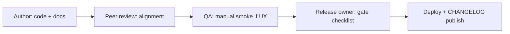

# Product Documentation Standard

**Version:** 2.1  
**Last updated:** 2026-07-07  
**Applies to:** Working Hours Tracker (`working-hours-tracker/`)

---

## 1. Purpose

This document defines the **mandatory documentation inventory**, quality bar, ownership model, and release gates for Working Hours Tracker. It ensures product, engineering, design, localization, and operations teams share a single, accurate source of truth aligned with the running application.

### Objectives

| Objective | Outcome |
|-----------|---------|
| **Accuracy** | Docs reflect current code paths, APIs, env vars, and data schema. |
| **Completeness** | Every major feature, variable, metric, and limitation is documented. |
| **Traceability** | Requirements map to stories, code, tests, and KPIs. |
| **Operability** | Runbooks and guardrails support release and incident response. |
| **Readability** | Professional wording, tables, diagrams, and examples for all audiences. |

---

## 2. Mandatory Documentation Inventory

### 2.1 Root-level files

| # | File | Audience | Purpose |
|---|------|----------|---------|
| 1 | `README.md` | All | Product overview, benefits, features, setup, doc map |
| 2 | `PRODUCT_DOCUMENTATION_STANDARD.md` | All | This standard |
| 3 | `CHANGELOG.md` | All | Historical development log |

### 2.2 Product strategy and requirements (`docs/`)

| # | File | Owner | Purpose |
|---|------|-------|---------|
| 4 | `docs/PRD.md` | Product | Vision, scope, FRs, NFRs, risks, acceptance |
| 5 | `docs/USER_PERSONAS.md` | Product | Persona goals, pains, success criteria |
| 6 | `docs/USER_STORIES.md` | Product | Epics, stories, acceptance criteria |
| 7 | `docs/PRODUCT_METRICS.md` | Product + Eng | KPI definitions, formulas, targets |
| 8 | `docs/METRICS_AND_OKRS.md` | Product | Quarterly OKRs linked to KPIs |

### 2.3 Data, logic, and traceability

| # | File | Owner | Purpose |
|---|------|-------|---------|
| 9 | `docs/VARIABLES.md` | Engineering | Variable dictionary + relationship chart |
| 10 | `docs/TRACEABILITY_MATRIX.md` | Shared | Req → story → code → test → metric |
| 11 | `docs/FEATURE_LOGIC_CATALOG.md` | Engineering | Behavioral logic by feature area |
| 12 | `docs/DATA_SCHEMA_EXAMPLES.md` | Engineering | JSON examples for schema validation |

### 2.4 Design and governance

| # | File | Owner | Purpose |
|---|------|-------|---------|
| 13 | `docs/DESIGN_GUIDELINES.md` | Design + Eng | Themes, tokens, components, a11y |
| 14 | `docs/GUARDRAILS.md` | Shared | Business and technical limitations |
| 15 | `docs/SECURITY_MODEL.md` | Engineering | Threat model, controls, practices |
| 16 | `docs/BUSINESS_GUIDELINES.md` | Product | Positioning, decision principles |
| 17 | `docs/TECHNICAL_GUIDELINES.md` | Engineering | Code, performance, quality norms |

### 2.5 Engineering and operations

| # | File | Owner | Purpose |
|---|------|-------|---------|
| 18 | `docs/ARCHITECTURE.md` | Engineering | Topology, data flow, decisions |
| 19 | `docs/API_CONTRACTS.md` | Engineering | Endpoint semantics, auth, errors |
| 20 | `docs/DEPLOYMENT_VERCEL.md` | Engineering | Vercel deploy steps |
| 21 | `docs/TEST_STRATEGY.md` | Engineering | Automated + manual coverage |
| 22 | `docs/OPERATIONS_RUNBOOK.md` | Operations | Incidents, rollback, monitoring |

### 2.6 Release control

| # | File | Owner | Purpose |
|---|------|-------|---------|
| 23 | `docs/RELEASE_NOTES_DRAFT.md` | Product | Draft release notes |
| 24 | `docs/RELEASE_SIGNOFF_TEMPLATES.md` | Product | Sign-off checklists |
| 25 | `docs/README.md` | Shared | Documentation hub index |

---

## 3. Content Requirements by Document Type

### 3.1 README
Must include: product overview, benefits, feature list, logic summary, tech stack, folder structure, local setup, production env vars, test commands, documentation map, changelog link.

### 3.2 PRD
Must include: vision, problem statement, in/out of scope, numbered functional requirements (FR-##), non-functional requirements (NFR-##), user outcomes, risks, acceptance criteria.

### 3.3 User personas
Each persona must define: name/role, goals, pain points, needs, success criteria, and primary workflows in the app.

### 3.4 User stories
Organized by epic (E#). Each story: ID (US-###), role statement, acceptance criteria (testable bullets), linked FR IDs.

### 3.5 Variables documentation
For **every** persisted or computed variable:

| Column | Required |
|--------|----------|
| Variable name | Machine key (e.g. `breakMinutes`) |
| Friendly name | Human label |
| Definition | What it represents |
| Formula / rule | Calculation or validation |
| App location | File(s) and UI surface |
| Example | Concrete sample value |

Plus a **Mermaid relationship diagram** showing how variables connect.

### 3.6 Metrics documentation
Each KPI: name, definition, formula, data source, target, owner, review cadence. OKRs must reference KPIs explicitly.

### 3.7 Design guidelines
Must document: design principles, IA, **all theme palettes** (CSS token table per theme), component rules, accessibility, localization UI rules.

### 3.8 Traceability matrix
Rows: Requirement ID | Summary | Stories | Code paths | Tests (actual file names) | Metrics. **No fictional test file references.**

### 3.9 Guardrails
Separate sections: business, technical, performance, quality, operational. Each limitation states *why* and *what to do instead*.

### 3.10 Changelog
Reverse chronological. Each entry: date, category (feature/fix/docs/refactor), impact summary, affected files.

---

## 4. Quality Requirements

### 4.1 Accuracy
- File paths, port numbers, env var names, and enum values must match `js/constants.js`, `api/`, and `vercel.json`.
- Remove documentation for deleted code (e.g. retired modules) within the same release.
- Mark deprecated behaviors with **Deprecated** label and removal target.

### 4.2 Completeness
- New features require updates to PRD (if in scope), stories, variables, feature catalog, and traceability.
- New UI strings require i18n key documentation in feature catalog or variables appendix.

### 4.3 Readability
- Use tables for dictionaries and palettes.
- Use Mermaid for flows and relationships.
- Write in complete sentences; avoid unexplained acronyms.

### 4.4 Governance
- Documentation changes ship with related code changes unless docs-only release.
- `docs/README.md` index must list all current doc files.

---

## 5. Update Triggers

Documentation updates are **required** when any of the following change:

| Trigger | Minimum doc updates |
|---------|---------------------|
| Feature behavior | PRD, stories, FEATURE_LOGIC_CATALOG, VARIABLES, CHANGELOG |
| Data schema | VARIABLES, DATA_SCHEMA_EXAMPLES, API_CONTRACTS, merge tests note |
| API / auth | API_CONTRACTS, SECURITY_MODEL, OPERATIONS_RUNBOOK |
| UI theme / tokens | DESIGN_GUIDELINES |
| New i18n keys | USER_STORIES (if user-facing), verify scripts README |
| Metrics / OKR shift | PRODUCT_METRICS, METRICS_AND_OKRS |
| Deployment config | DEPLOYMENT_VERCEL, ARCHITECTURE |
| Removed / dead code | CHANGELOG, VARIABLES, TRACEABILITY_MATRIX |

---

## 6. Review Workflow

1. **Author** updates code and documentation together in one change set.
2. **Reviewer** validates code-doc alignment (paths, formulas, enums).
3. **Release owner** runs release documentation gate (Section 7).
4. **Operations** confirms runbook/guardrails if deploy or security impact exists.

---

## 7. Release Documentation Gate

Before production deploy approval:

- [ ] `npm test` passes (all automated tests green)
- [ ] No new secrets in repo; `.env` patterns in `.gitignore`
- [ ] `README.md` and `docs/README.md` reflect current setup
- [ ] PRD / personas / stories updated for scope changes
- [ ] `VARIABLES.md` updated for schema or formula changes
- [ ] `TRACEABILITY_MATRIX.md` references **actual** test files
- [ ] `DESIGN_GUIDELINES.md` updated for theme/token changes
- [ ] `GUARDRAILS.md` / `SECURITY_MODEL.md` updated if operational impact
- [ ] `CHANGELOG.md` entry with date and impact
- [ ] i18n: `npm run verify:i18n` clean for new keys (when applicable)

---

## 8. Ownership Model

| Domain | Primary owner | Backup |
|--------|---------------|--------|
| PRD, personas, stories, OKRs | Product | Engineering lead |
| Architecture, API, variables, tests | Engineering | Product |
| Design guidelines, themes | Design / Eng | Product |
| Security, guardrails, runbook | Engineering | Operations |
| README, traceability, changelog | Shared | Release owner |
| Localization packs | Localization | Engineering |

---

## 9. Related Artifacts

- i18n tooling: `scripts/README-i18n-tools.md`
- Agent / automation skills: project Cursor rules (if configured)

---

## 10. Revision History

| Date | Version | Summary |
|------|---------|---------|
| 2026-04-28 | 1.0 | Initial documentation baseline |
| 2026-04-29 | 1.1 | Governance and ops doc expansion |
| 2026-07-07 | 2.0 | Full elaborative standard; inventory tables; gate checklist; accuracy rules for traceability |
| 2026-07-07 | 2.1 | Sync-status module documented; v2.1 alignment across VARIABLES, architecture, traceability |
