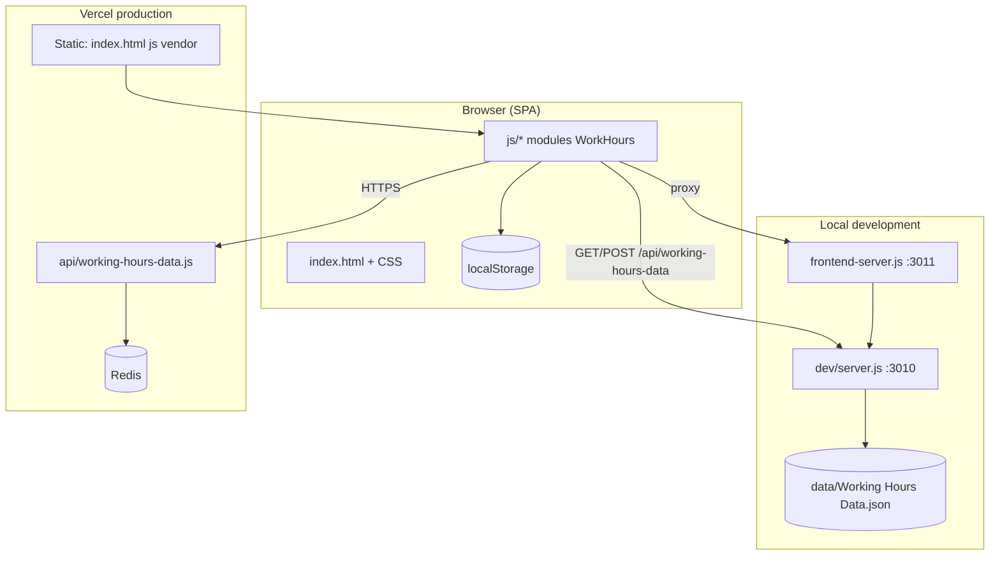

# Architecture

**Product:** Working Hours Tracker  
**Last updated:** 2026-07-07

---

## 1. High-Level Topology



---

## 2. Module Architecture (client)

Scripts load in dependency order from `index.html`. All modules extend `window.WorkHours` (namespace `W`).

| Layer | Modules | Responsibility |
|-------|---------|----------------|
| **Foundation** | `constants.js`, `sync-status.js`, `storage.js` | Keys, save status badge, persistence |
| **Domain** | `profile.js`, `entries.js`, `vacation-days.js`, `time.js` | Business entities |
| **Features** | `form.js`, `clock.js`, `voice-entry.js`, `modal.js`, `filters.js`, `calendar.js`, `render.js` | User workflows |
| **Analytics** | `stats-summary.js`, `infographic.js`, `highlights-ppt.js` | Reporting UI |
| **IO** | `export.js`, `import.js`, `data-sync.js` | Portability + sync |
| **UX** | `i18n.js`, `smart-select.js`, `timezone-picker.js`, `help.js`, `init.js` | Bootstrap + polish |

**Shared library:** `lib/merge-working-hours.js` — used by client (`data-sync.js`) and server (`api/working-hours-data.js`, `dev/server.js`).

---

## 3. Data Flow

### 3.1 Write path

```
User action
  → mutate W.getData() in memory
  → W.setData() → localStorage (workingHoursData)
  → scheduleAutoSave (800 ms debounce)
  → setSyncStatusDisplay('saving') via sync-status.js
  → autosave queue → POST /api/working-hours-data
  → setSyncStatusDisplay('saved') or retry/error states
  → server: mergeAndNormalizeWorkingHoursPayload → persist
```

### 3.2 Read path (startup)

```
init()
  → load localStorage
  → GET /api/working-hours-data (silent)
  → mergeWorkingHoursData(local, remote)
  → setData + render UI
  → restoreLastProfile({ enforceAccess: true })
```

### 3.3 Export path

```
exportToCsv / exportToJson
  → resolveExportDataByAccess (skip locked)
  → build rows from profileMeta + entries + vacation
  → trigger browser download
```

---

## 4. Key Architectural Decisions

| Decision | Rationale | Trade-off |
|----------|-----------|-----------|
| Vanilla JS namespace vs framework | Zero build step; simple deploy | Manual dependency order |
| Shared merge library | Client/server parity | Must keep in sync |
| Snapshot POST semantics | Deterministic server state | Omissions delete data |
| localStorage primary | Offline-first UX | Size limits on huge datasets |
| Inline CSS in index.html | Single artifact deploy | Large HTML file |
| Manual i18n packs | Quality + offline | Maintenance per locale |
| Profile password client-side | No auth server for individuals | Not enterprise IAM |

---

## 5. External Dependencies

| Dependency | Role |
|------------|------|
| Chart.js 4.4.1 | Stats summary charts |
| Luxon 3.4.4 | Timezone conversion |
| PptxGenJS | PowerPoint generation |
| Redis | Production persistence |
| Express | Local API only |

---

## 6. Security Boundaries

- **Browser:** Profile lock, localStorage, optional speech/network APIs.
- **API:** Optional `X-API-Key`; CORS `*` on `/api`.
- **Secrets:** `REDIS_URL`, `WORKHOURS_API_KEY` in Vercel env only.

See `SECURITY_MODEL.md`.

---

## 7. Scalability Notes

- Current design targets **single-user / small team** profiles per browser.
- Redis stores **one JSON blob** per deployment key—not multi-tenant row storage.
- Large entry counts (10k+) may need pagination/virtualization (not yet implemented).

---

## 8. Related Documents

- `API_CONTRACTS.md`
- `DEPLOYMENT_VERCEL.md`
- `VARIABLES.md`
- `FEATURE_LOGIC_CATALOG.md`
