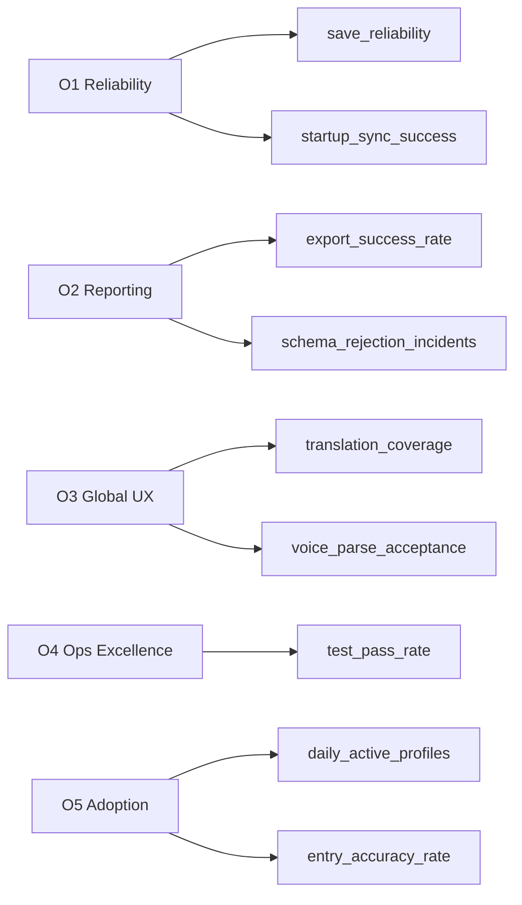

# Metrics and OKRs

**Product:** Working Hours Tracker  
**Period:** 2026 H2 (rolling; update quarterly)  
**Last updated:** 2026-07-06

---

## 1. OKR Structure

Objectives describe **outcomes**. Key Results are **measurable** and tied to KPIs in `PRODUCT_METRICS.md`.

---

## 2. Objective 1 — Reliability of Core Logging

**Owner:** Engineering lead  
**Why:** Users abandon tools that lose or corrupt time records.

| KR | Statement | Metric | Target | Status cadence |
|----|-----------|--------|--------|----------------|
| **KR1.1** | Achieve high save reliability | `save_reliability` | ≥ 99.0% monthly | Weekly |
| **KR1.2** | Startup sync completes successfully | `startup_sync_success` | ≥ 99.5% | Weekly |
| **KR1.3** | Limit critical save regressions | P0/P1 save defects per release | < 1 per release | Per release |

**Initiatives**
- Harden autosave retry in `storage.js` / `data-sync.js`
- Monitor API 5xx on POST `/api/working-hours-data`
- Expand merge test cases for edge dates/timezones

---

## 3. Objective 2 — Reporting Efficiency

**Owner:** Product manager  
**Why:** Managers are a key adoption driver for sustained use.

| KR | Statement | Metric | Target | Status cadence |
|----|-----------|--------|--------|----------------|
| **KR2.1** | Reduce report preparation time | User-reported prep time | −40% vs spreadsheet baseline | Quarterly survey |
| **KR2.2** | Maintain export success | `export_success_rate` | ≥ 98% | Monthly |
| **KR2.3** | Zero schema rejection in pipelines | `schema_rejection_incidents` | 0 / quarter | Monthly |

**Initiatives**
- Key Highlights PPT template improvements
- Infographic CSV section exports
- Stable CSV column order documented in `VARIABLES.md`

---

## 4. Objective 3 — Global User Experience Quality

**Owner:** Product + Localization  
**Why:** Global workforce requires complete translations and accessible input methods.

| KR | Statement | Metric | Target | Status cadence |
|----|-----------|--------|--------|----------------|
| **KR3.1** | Full i18n coverage at release | `translation_coverage` | 100% shipped keys | Per release |
| **KR3.2** | Voice parse acceptance | `voice_parse_acceptance` | ≥ 80% | Monthly sample |
| **KR3.3** | Limit UX blocking defects | P0/P1 UX defects | < 2 / quarter | Quarterly |

**Initiatives**
- Manual locale pack updates for every new feature
- Voice parser regression checklist (multilingual samples)
- Theme contrast audit for top 10 themes

---

## 5. Objective 4 — Operational Excellence

**Owner:** Release manager / Operations  
**Why:** Predictable releases reduce incident cost and doc drift.

| KR | Statement | Metric | Target | Status cadence |
|----|-----------|--------|--------|----------------|
| **KR4.1** | Release checklist adherence | Gate items completed / total | 100% | Per release |
| **KR4.2** | Fast recovery from P1 incidents | MTTR P1 | < 60 minutes | Per incident |
| **KR4.3** | Documentation traceability | FR rows with updated code+test refs | 100% on scope change | Per release |

**Initiatives**
- `RELEASE_SIGNOFF_TEMPLATES.md` enforcement
- `OPERATIONS_RUNBOOK.md` Redis/API triage paths
- Traceability matrix audit in doc review

---

## 6. Objective 5 — Adoption and Engagement (stretch)

**Owner:** Product  
**Why:** Validates product-market fit for daily use.

| KR | Statement | Metric | Target |
|----|-----------|--------|--------|
| **KR5.1** | Daily logging habit | `daily_active_profiles` | ≥ 85% expected users |
| **KR5.2** | Same-day entry accuracy | `entry_accuracy_rate` | ≥ 92% |
| **KR5.3** | Profile lock on shared devices | `profile_lock_adoption` | ≥ 50% multi-user deployments |

---

## 7. OKR ↔ KPI Mapping

---

## 8. Scoring Guide (end of quarter)

| Score | Meaning |
|-------|---------|
| **0.0–0.3** | Failed — fundamental miss |
| **0.4–0.6** | Partial — progress but target not met |
| **0.7–0.9** | Met — at or near target |
| **1.0** | Exceeded — materially above target |

Grade each KR independently; Objective score = average of KR scores.

---

## 9. Review Calendar

| Meeting | Frequency | Participants | Outputs |
|---------|-----------|--------------|---------|
| KPI standup | Weekly | Eng + Product | Save/sync/export trends |
| OKR check-in | Monthly | Leadership + Product | KR score updates |
| Quarterly retrospective | Quarterly | All stakeholders | OKR final scores, next quarter OKRs |

---

## 10. Related Documents

- `PRODUCT_METRICS.md` — formula and source detail
- `PRD.md` — objectives alignment
- `CHANGELOG.md` — initiative delivery log
