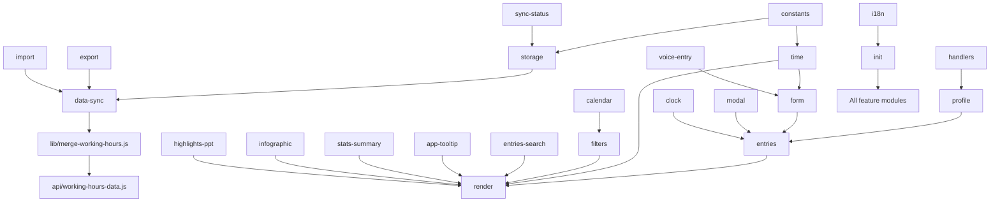

# Module Reference

**Product:** Working Hours Tracker  
**Last updated:** 2026-07-08  
**Audience:** Engineering, QA, technical writers

Authoritative catalog of every runtime JavaScript module, shared library, API handler, and maintenance script. Use alongside `ARCHITECTURE.md` (topology) and `VARIABLES.md` (data dictionary).

---

## 1. Summary

| Category | Count | Location |
|----------|-------|----------|
| Client feature modules | 28 | `js/*.js` (excluding locale packs) |
| Manual locale packs | 24 | `js/i18n-*-locale.js` |
| Shared merge library | 1 | `lib/merge-working-hours.js` |
| Production API | 1 | `api/working-hours-data.js` |
| Local dev server | 1 | `dev/server.js` |
| Frontend proxy | 1 | `frontend-server.js` |
| Maintenance scripts | 14 | `scripts/*.js` |
| Automated tests | 2 | `tests/*.test.js` |

**Namespace pattern:** All client modules extend `window.WorkHours` via IIFE:

```javascript
(function (W) { 'use strict'; /* ... */ })(window.WorkHours = window.WorkHours || {});
```

**Script load order:** Defined in `index.html` — constants and persistence first, domain modules, locale packs, `i18n.js`, UX helpers, `init.js` last.

---

## 2. Client Modules — Foundation

### `js/constants.js`

| Attribute | Detail |
|-----------|--------|
| **Purpose** | App-wide configuration constants |
| **Dependencies** | None |
| **Key exports** | `STORAGE_KEY`, `DAY_NAMES`, `NON_WORK_DEFAULTS`, `STANDARD_WORK_MINUTES_PER_DAY`, `SUPPORTED_YEAR_MIN/MAX`, `DEFAULT_TIMEZONE`, `TIMEZONE_LABELS` |
| **UI surfaces** | Indirect — consumed by forms, filters, time math |

### `js/sync-status.js`

| Attribute | Detail |
|-----------|--------|
| **Purpose** | Save/sync status badge (`#saveDataStatus`) |
| **Dependencies** | `i18n.js` (for `sync.*` keys) |
| **Key exports** | `setSyncStatusDisplay`, `clearSyncStatusDisplay`, `refreshSyncStatusDisplay` |
| **DOM contract** | `data-sync-status-key`, `data-sync-status-kind`, `data-sync-status-subs` |
| **UI surfaces** | Header save status badge |

### `js/storage.js`

| Attribute | Detail |
|-----------|--------|
| **Purpose** | `localStorage` read/write with debounced autosave |
| **Dependencies** | `constants.js`, `data-sync.js`, `sync-status.js` |
| **Key exports** | `getData`, `setData` |
| **Internal state** | `autoSaveTimer`, `autoSaveDirty`, `autoSaveInFlight`, `autoSaveRetryCount` |
| **Timing** | 800 ms debounce, 4000 ms retry interval, 3 max retries |
| **Data flow** | `setData` → `scheduleAutoSave` → `saveWorkingHoursDataToFile` |

---

## 3. Client Modules — Domain

### `js/profile.js`

| Attribute | Detail |
|-----------|--------|
| **Purpose** | Multi-profile management and optional password protection |
| **Key exports** | `getProfile`, `getProfileNames`, `getProfileRole`, `setProfileRole`, `hasProfilePassword`, `setProfilePassword`, `verifyProfilePassword`, `isProfileAccessUnlocked`, `requireProfileAccess`, `refreshProfileSelect`, `ensureProfileId` |
| **Runtime state** | `_profileAuthSession`, `_profileAuthModalResolver` |
| **Security** | SHA-256 password hash in `profileMeta`; session unlock in memory only |

### `js/entries.js`

| Attribute | Detail |
|-----------|--------|
| **Purpose** | Profile-scoped entry CRUD and ID normalization |
| **Key exports** | `getEntries`, `setEntries`, `getLastClock`, `setLastClock`, `ensureAllEntryIds` |
| **Access gate** | Returns empty array when profile is password-locked |

### `js/vacation-days.js`

| Attribute | Detail |
|-----------|--------|
| **Purpose** | Per-profile annual vacation day quotas |
| **Key exports** | `getVacationDaysByYear`, `setVacationDaysBulk`, `getVacationAllowance`, `openVacationDaysModal`, `closeVacationDaysModal`, `saveVacationDaysModal` |
| **Runtime state** | `_vacationRangeExpandBefore`, `_vacationRangeExpandAfter`, `_vacationDaysModalDraft` |

### `js/time.js`

| Attribute | Detail |
|-----------|--------|
| **Purpose** | Time math, formatting, timezone utilities |
| **Key exports** | `parseTime`, `normalizeTimeToHHmm`, `workingMinutes`, `formatMinutes`, `formatDisplayNumber`, `getISOWeek`, `generateId`, `getBrowserTimezone`, `getIpBasedTimezone`, `initEntryDefaultTimezone`, `formatEntryInViewZone`, `formatClockInOutInZone` |
| **Runtime state** | `_resolvedEntryTimezoneSource`, `_entryTimezoneUserSelected`, `_bulkEntryTimezoneUserSelected` |
| **External** | Luxon (CDN) for IANA conversion |

---

## 4. Client Modules — Sync and IO

### `js/data-sync.js`

| Attribute | Detail |
|-----------|--------|
| **Purpose** | Server sync, merge, deduplication, export payload |
| **Key exports** | `getFullExportPayload`, `mergeProfileEntriesArrays`, `dedupeAllProfilesEntryArrays`, `mergeWorkingHoursData`, `saveWorkingHoursDataToFile`, `syncWorkingHoursData`, `handleWorkingHoursDataFile` |
| **Shared logic** | `lib/merge-working-hours.js` |
| **Endpoints** | `GET/POST /api/working-hours-data` |

### `js/export.js`

| Attribute | Detail |
|-----------|--------|
| **Purpose** | CSV and JSON file download |
| **Key exports** | `exportToCsv`, `exportToJson`, `exportToBoth` |
| **Rules** | Password-gated per profile; UTF-8 BOM on CSV |

### `js/import.js`

| Attribute | Detail |
|-----------|--------|
| **Purpose** | CSV and JSON import with merge |
| **Key exports** | `importFromJson`, `handleImportCsv`, `handleImportJson` |
| **Formats** | Global save, per-profile, plain entry arrays |

---

## 5. Client Modules — Entry Workflows

### `js/form.js`

| Attribute | Detail |
|-----------|--------|
| **Purpose** | Single and bulk entry forms |
| **Key exports** | `getEntryFormValues`, `handleSaveEntry`, `handleAddMultipleEntries`, `setBulkEntriesPanelVisible`, `addBulkEntryRow`, `resetBulkEntryRows`, `fillBulkEntriesExample`, `syncLocationAndTimeFieldsForDayStatus` |
| **Runtime state** | `_bulkActiveIndex` |
| **Business rules** | Non-work days → `NON_WORK_DEFAULTS`; work days → WFO/WFH only |

### `js/clock.js`

| Attribute | Detail |
|-----------|--------|
| **Purpose** | Quick clock-in/out buttons |
| **Key exports** | `clockIn`, `clockOut` |
| **Persistence** | `lastClock_<profile>` in root data object |

### `js/voice-entry.js`

| Attribute | Detail |
|-----------|--------|
| **Purpose** | Web Speech API voice input with review modal |
| **Key exports** | Voice parse helpers, review modal apply/cancel |
| **Languages** | `getVoiceRecognitionLangTag()` maps UI locale to speech locale |
| **Flow** | Parse → review modal → apply to single/bulk/edit form |

### `js/modal.js`

| Attribute | Detail |
|-----------|--------|
| **Purpose** | Edit entry modal and batch editing |
| **Key exports** | `openEditModal`, `closeEditModal`, `startEditEntryBatch`, `handleSaveEdit`, `openDeleteConfirmModal` |
| **Runtime state** | `_editBatchOrderedIds`, `_editBatchIndex` |

### `js/handlers.js`

| Attribute | Detail |
|-----------|--------|
| **Purpose** | Profile CRUD event handlers |
| **Key exports** | `handleProfileChange`, `handleAddProfile`, `handleSaveEditProfile`, `confirmDeleteProfile`, profile modal open/close helpers |
| **Persistence** | `workingHoursLastProfile` in localStorage |

---

## 6. Client Modules — Filters, Search, Render

### `js/filters.js`

| Attribute | Detail |
|-----------|--------|
| **Purpose** | Entry filtering (basic + advanced) |
| **Key exports** | `getFilterValues`, `getFilteredEntries`, `refreshFilterYearWeek`, `bindFilterListeners` |
| **Runtime state** | `_calendarSelectedDates`, `_entriesShowAllDates`, `_entriesViewTimezone` |
| **Dimensions** | Year, month, day, week, weekday, status, location, overtime, description, search intents |

### `js/entries-search.js`

| Attribute | Detail |
|-----------|--------|
| **Purpose** | Typeahead search for entries table |
| **Key exports** | `initEntriesSearch` |
| **Behavior** | Builds candidate pools; keyboard navigation; triggers `renderEntries` |

### `js/calendar.js`

| Attribute | Detail |
|-----------|--------|
| **Purpose** | Month grid calendar with entry indicators |
| **Key exports** | `getCalendarMonth`, `setCalendarMonth`, `renderCalendar`, `syncFiltersFromCalendar`, `bindCalendarListeners` |
| **Runtime state** | `_calendarYear`, `_calendarMonth`, `_calendarSelectedDates` |
| **Visual encoding** | Status background; location dots; overtime bar |

### `js/render.js`

| Attribute | Detail |
|-----------|--------|
| **Purpose** | Entries table, statistics card, selection management |
| **Key exports** | `buildEntryRowHtml`, `renderEntries`, `computeStats`, `renderStatsBox`, `setEntriesSort`, `editSelectedEntry`, `deleteSelectedEntry` |
| **Runtime state** | `_entriesSortBy`, `_entriesSortDir`, `_selectedEntryIds`, `_entriesViewTimezone` |

### `js/app-tooltip.js`

| Attribute | Detail |
|-----------|--------|
| **Purpose** | Shared custom tooltips for stats and entries |
| **Key exports** | `buildAppTooltipAttr`, `buildAppTooltipData`, `renderAppTooltipHtml`, `initAppTooltips` |
| **DOM** | `#appCustomTooltip`; triggers via `data-app-tooltip` |
| **Runtime state** | `_appTooltipBound` |

---

## 7. Client Modules — Analytics and Reporting

### `js/stats-summary.js`

| Attribute | Detail |
|-----------|--------|
| **Purpose** | Chart.js statistics modal (General + Details) |
| **Views** | Weekly, monthly, quarterly, annually |
| **Key exports** | `openStatsSummaryModal`, `statsSummaryViewChange`, `downloadEnlargedChart` |
| **External** | Chart.js 4.4.1 (CDN) |

### `js/infographic.js`

| Attribute | Detail |
|-----------|--------|
| **Purpose** | Rich infographic popup with vacation/work/overtime tables |
| **Key exports** | Infographic modal open/render, CSV section export, fullscreen card |
| **Persistence** | `workingHours.infographicTimeframe` in localStorage |

### `js/highlights-ppt.js`

| Attribute | Detail |
|-----------|--------|
| **Purpose** | PowerPoint export via PptxGenJS |
| **Key exports** | PPT generation modal and slide builders |
| **External** | `vendor/pptxgen.bundle.js` |

---

## 8. Client Modules — UX and Bootstrap

### `js/i18n.js`

| Attribute | Detail |
|-----------|--------|
| **Purpose** | Core internationalization engine (~2200 lines) |
| **Key exports** | `W.I18N.t`, `I18N.applyTranslations`, `getBrowserLanguage`, `translateDynamicUserText` |
| **Runtime state** | `currentLanguage` |
| **Rollout** | Language gating via `workingHoursLanguageRolloutStage` (g3/g5/g10/g20/all) |

### `js/i18n-*-locale.js` (24 packs)

| Codes | Files |
|-------|-------|
| af, ar, cs, da, de, el, es, fi, fr, hi, id, it, ja, ko, nl, no, pl, pt, pt-BR, ru, sv, tr, uk, zh | `js/i18n-{code}-locale.js` |

Each pack sets `window.__WH_TRANSLATIONS_<CODE>` merged into `i18n.js` at load time.

### `js/smart-select.js`

| Attribute | Detail |
|-----------|--------|
| **Purpose** | Typeahead-enhanced `<select>` replacements |
| **Key exports** | `initSmartSingleSelects`, `refreshSmartSingleSelects` |

### `js/timezone-picker.js`

| Attribute | Detail |
|-----------|--------|
| **Purpose** | Searchable IANA timezone dropdown |
| **Key exports** | `initTimezonePickers` |

### `js/help.js`

| Attribute | Detail |
|-----------|--------|
| **Purpose** | Contextual help modals |
| **Key exports** | `openHelpModal`, `closeHelpModal` |

### `js/init.js`

| Attribute | Detail |
|-----------|--------|
| **Purpose** | Application bootstrap and DOM event binding (~1550 lines) |
| **Key exports** | `init`, `applyTheme`, `initTheme`, `bindEventListeners`, `updateInternetStatusIndicator`, `updateLocationStatusIndicator`, `refreshDynamicTranslations` |
| **Startup** | Dedupe → ensure IDs → render → bind listeners → silent sync |
| **Themes** | 36 country/region themes via `body[data-theme]` |
| **Runtime state** | Internet/location status RAF and interval IDs; `_pendingEditEntry`, `_pendingDeleteConfirm`, `_lastAuthorizedProfile` |

---

## 9. Shared Library

### `lib/merge-working-hours.js`

| Export | Purpose |
|--------|---------|
| `canonicalEntryDate` | Normalize dates to `YYYY-MM-DD` |
| `mergeEntriesArrays` | Per-profile entry merge |
| `mergeWorkingHoursRoot` | Full root merge |
| `mergeAndNormalizeWorkingHoursPayload` | Merge + sort all arrays |
| `sortAllEntryArraysByDate` | Ascending date sort |

**Consumers:** `js/data-sync.js`, `api/working-hours-data.js`, `dev/server.js`, `tests/merge-working-hours.test.js`

---

## 10. Server Modules

### `api/working-hours-data.js`

| Attribute | Detail |
|-----------|--------|
| **Purpose** | Vercel serverless handler for Redis persistence |
| **Methods** | `GET/HEAD` retrieve; `POST` merge + replace snapshot |
| **Env vars** | `REDIS_URL`, `WORKHOURS_API_KEY`, `WORKHOURS_REDIS_KEY` |
| **Exports** | `createHandler(deps)`, default handler |

### `dev/server.js`

| Attribute | Detail |
|-----------|--------|
| **Purpose** | Local Express server (port 3010) |
| **Serves** | Static files + `/api/working-hours-data` → `data/Working Hours Data.json` |
| **CORS** | Enabled for cross-port proxy |

### `frontend-server.js`

| Attribute | Detail |
|-----------|--------|
| **Purpose** | Static server on port 3011 with API proxy to 3010 |
| **Use case** | Frontend-only dev with separate API port |

---

## 11. Maintenance Scripts (`scripts/`)

| Script | Purpose |
|--------|---------|
| `verify-i18n-locales.js` | Validate locale pack codes vs language selector |
| `verify-manual-locale-packs-offline.js` | Check packs complete vs English |
| `generate-manual-locale-from-en-translated.js` | Auto-generate locale via Google Translate |
| `standardize-manual-locale-pack-format.js` | Normalize locale file format |
| `sync-locale-sync-keys.js` | Sync translation keys across locales |
| `remove-dead-i18n-keys.js` | Remove verified orphaned i18n keys |
| `update-internet-status-i18n-keys.js` | Patch internet status keys |
| `patch-stats-summary-*.js` | Stats summary i18n patches |
| `apply-stats-summary-translations.js` | Bulk stats translations |
| `qa-i18n-quick.js` | Quick i18n QA runner |
| `extract-manual-id-locale-from-i18n.js` | Extract Indonesian locale |

See `scripts/README-i18n-tools.md` for workflow detail.

---

## 12. Module Dependency Graph



---

## 13. External Dependencies (CDN / vendor)

| Library | Version | Loaded from | Used by |
|---------|---------|-------------|---------|
| Chart.js | 4.4.1 | jsDelivr CDN | `stats-summary.js` |
| Luxon | 3.4.4 | jsDelivr CDN | `time.js`, timezone display |
| PptxGenJS | 3.12.0 | `vendor/pptxgen.bundle.js` | `highlights-ppt.js` |

---

## 14. Related Documents

- `ARCHITECTURE.md` — system topology and data flows
- `VARIABLES.md` — data dictionary and relationship chart
- `FEATURE_LOGIC_CATALOG.md` — behavioral rules by feature
- `TRACEABILITY_MATRIX.md` — requirement → module mapping
- `API_CONTRACTS.md` — REST endpoint semantics
