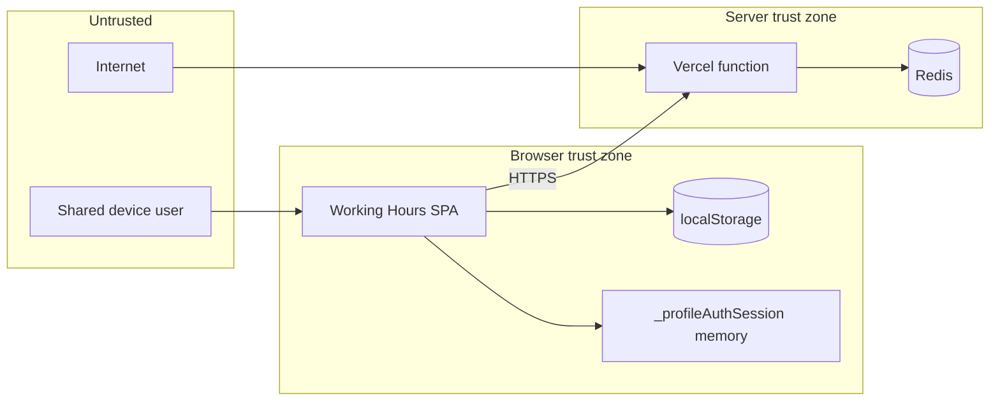

# Security Model

**Product:** Working Hours Tracker  
**Last updated:** 2026-07-22

---

## 1. Scope

Security controls cover:

- Profile-level access in the browser
- API write protection in production
- Deployment hardening (headers, secrets)
- Safe export/import handling

**Out of scope:** Enterprise SSO, encryption at rest for localStorage, hardware security modules.

---

## 2. Trust Boundaries



---

## 3. Security Controls

| Control | Implementation | Strength |
|---------|----------------|----------|
| Profile password | SHA-256 hash in `profileMeta.passwordHash` | Medium (client-side) |
| Session unlock | In-memory only; cleared on refresh | Session |
| API write key | `X-API-Key` vs `WORKHOURS_API_KEY` | Configurable |
| Transport | HTTPS on Vercel | Strong |
| Security headers | `vercel.json` (`X-Frame-Options`, `Permissions-Policy`, etc.) | Medium |
| Microphone policy | Production `Permissions-Policy: microphone=()` | Blocks browser mic / Web Speech until explicitly allowed |
| CORS | `*` on API | Permissive (by design) |
| Redis credentials | `REDIS_URL` env | Strong if rotated |

---

## 4. Data Protection Rules

| Data type | Storage | Protection |
|-----------|---------|------------|
| Profile password | Hash only in JSON | Never log/compare plaintext |
| Entries | localStorage + Redis | Physical access = exposure |
| API key | Vercel env | Never in client bundle |
| Export files | User download | User controls destination |

---

## 5. Threat Model (summary)

| Threat | Likelihood | Impact | Mitigation |
|--------|------------|--------|------------|
| Wrong profile on shared PC | High | Medium | Profile lock, clear selector |
| localStorage inspection | Medium | High | Password lock; user education |
| Unauthorized API POST | Medium | High | `WORKHOURS_API_KEY` |
| Redis credential leak | Low | Critical | Rotate URL; Vercel secret scope |
| XSS in app | Low | Critical | No innerHTML from user text; sanitize displays |
| CDN supply chain | Low | Medium | Pinned versions |

---

## 6. Authentication Flows

### 6.1 Profile unlock

```
requireProfileAccess(profile)
  → hasProfilePassword? 
    → isProfileAccessUnlocked? return true
    → openProfileAuthModal → verifyProfilePassword
    → grantProfileAccessSession
```

### 6.2 API write (production)

```
POST /api/working-hours-data
  → WORKHOURS_API_KEY set?
    → X-API-Key matches? else 401
  → persist
```

---

## 7. Operational Practices

- Rotate `WORKHOURS_API_KEY` and `REDIS_URL` if exposure suspected.
- Review Vercel function logs for 401 spikes.
- Do not commit `data/Working Hours Data.json` (may contain hashes and PII).
- Incident steps: `OPERATIONS_RUNBOOK.md`.

---

## 8. Privacy Notes

- Optional IP APIs (`ipapi.co`, `ipwho.is`) for location tooltip—no entry data sent.
- Optional Google Translate for UI strings—opt-in flag only.
- Speech recognition: browser vendor may process audio per their policy.
- **Production note:** `vercel.json` currently sets `Permissions-Policy: microphone=()`. Voice-assisted entry (FR-04) may be unavailable on the production origin until microphone is explicitly permitted for the app.

---

## 9. Related Documents

- `GUARDRAILS.md` — SG-* guardrails
- `API_CONTRACTS.md` — auth headers
- `DEPLOYMENT_VERCEL.md` — env configuration
- `PRD.md` — FR-04 voice scope and risks
