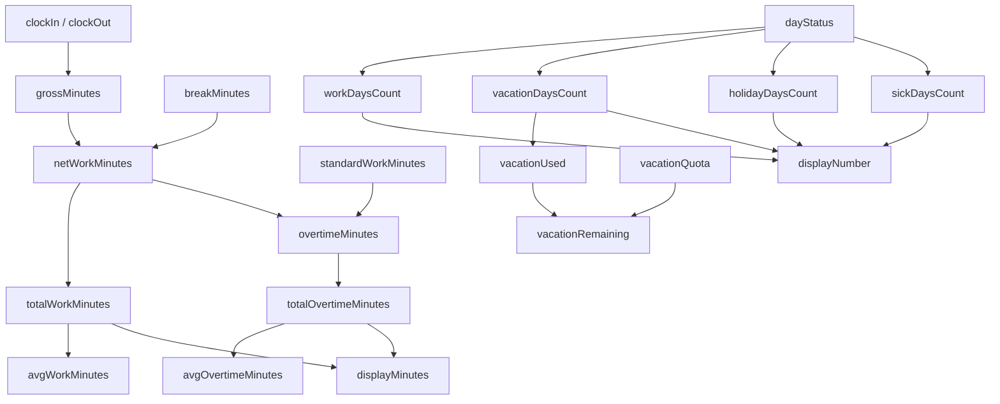

# Variables Dictionary

This document defines key product variables with naming, business meaning, formula, app location, and examples.

## 1. Core Entry Variables

| Variable Name | Friendly Name | Definition | Formula / Rule | Location in App | Example |
|---|---|---|---|---|---|
| `profileName` | Active Profile | Profile key for current working context. | Selected profile identifier from profile controls. | Profile section, storage, API payload keys | `Engineering - A` |
| `date` | Entry Date | Calendar day represented by an entry. | `YYYY-MM-DD` normalized date. | Entry form, table, calendar, stats | `2026-03-24` |
| `clockIn` | Start Time | Entry start time. | `HH:mm` normalized to `00:00..23:59`. | Entry form, table, calculations | `08:45` |
| `clockOut` | End Time | Entry end time. | `HH:mm` normalized to `00:00..23:59`. | Entry form, table, calculations | `18:10` |
| `breakMinutes` | Break Duration | Non-working minutes deducted from worked duration. | Integer minutes, min `0`. | Entry form, calculations, analytics | `60` |
| `dayStatus` | Day Type | Semantic category of the day. | One of: `work`, `vacation`, `holiday`, `sick`. | Entry form, table, calendar, stats cards | `work` |
| `location` | Work Location | Work location classification. | One of: `WFO`, `WFH`, `Anywhere`. | Entry form, filters, infographic tables | `WFH` |
| `description` | Work Description | Optional free-text context for the entry. | Trimmed text; empty allowed. | Entry form, search, table | `Client planning and code review` |
| `timezone` | Entry Timezone | IANA timezone associated with entry timing. | Selected or auto-detected timezone string. | Entry form, edit modal, table timezone display | `Europe/Berlin` |
| `createdAt` | Created Timestamp | Entry creation timestamp in ISO format. | Set when entry is first persisted. | Data storage, merge logic | `2026-03-24T08:01:15.000Z` |
| `updatedAt` | Updated Timestamp | Last modified timestamp in ISO format. | Updated during save/edit and merge winner logic. | Data storage, merge conflict resolution | `2026-03-24T17:45:41.000Z` |

## 2. Derived Duration and Day Variables

| Variable Name | Friendly Name | Definition | Formula / Rule | Location in App | Example |
|---|---|---|---|---|---|
| `grossMinutes` | Gross Duration | Raw minutes between clock-out and clock-in. | `clockOutMinutes - clockInMinutes` | Time utility and per-entry calculations | `565` |
| `netWorkMinutes` | Net Work Duration | Actual worked minutes after break. | `max(grossMinutes - breakMinutes, 0)` | Entries summary, stats | `505` |
| `standardWorkMinutes` | Standard Daily Target | Baseline expected daily working minutes. | Constant `8 * 60` | Constants and overtime formulas | `480` |
| `overtimeMinutes` | Overtime Duration | Minutes worked above standard target. | `max(netWorkMinutes - standardWorkMinutes, 0)` | Stats summary and overtime views | `25` |
| `isWorkDay` | Workday Flag | Indicates entry contributes to work-time aggregates. | `dayStatus === 'work'` | Aggregation logic and charts | `true` |

## 3. Aggregated Product Variables

| Variable Name | Friendly Name | Definition | Formula / Rule | Location in App | Example |
|---|---|---|---|---|---|
| `totalWorkMinutes` | Total Work Time | Sum of net worked minutes for workdays. | `sum(netWorkMinutes where dayStatus='work')` | Statistics cards and modals | `9620` |
| `totalOvertimeMinutes` | Total Overtime | Sum of positive overtime minutes. | `sum(overtimeMinutes)` | Statistics cards and charts | `540` |
| `avgWorkMinutes` | Average Daily Work Time | Average work minutes per workday. | `totalWorkMinutes / workDaysCount` | Statistics summary | `481` |
| `avgOvertimeMinutes` | Average Daily Overtime | Average overtime per workday. | `totalOvertimeMinutes / workDaysCount` | Statistics summary | `27` |
| `workDaysCount` | Work Days | Number of entries with `dayStatus='work'`. | Count rule | Days-by-type cards and filters | `20` |
| `vacationDaysCount` | Vacation Days | Number of entries with `dayStatus='vacation'`. | Count rule | Days-by-type cards | `2` |
| `holidayDaysCount` | Holidays | Number of entries with `dayStatus='holiday'`. | Count rule | Days-by-type cards | `1` |
| `sickDaysCount` | Sick Days | Number of entries with `dayStatus='sick'`. | Count rule | Days-by-type cards | `1` |
| `vacationQuota` | Vacation Quota | Allowed vacation days for profile period. | Configured per profile metadata | Infographic summary tables | `24` |
| `vacationUsed` | Vacation Used | Consumed vacation days in period. | Count of vacation entries in range | Infographic summary tables | `7` |
| `vacationRemaining` | Vacation Remaining | Unused vacation balance. | `max(vacationQuota - vacationUsed, 0)` | Infographic vacation tables | `17` |

## 4. Formatting Variables and Display Helpers

| Variable Name | Friendly Name | Definition | Formula / Rule | Location in App | Example |
|---|---|---|---|---|---|
| `displayNumber` | Display Number | Locale-aware compact or full numeric representation. | `formatDisplayNumber(value, options)` | Stats, infographic, table labels | `1.2K` |
| `displayMinutes` | Display Duration | Locale-aware long/short minute formatting. | `formatMinutes(value, options)` | Cards, tooltips, summary text | `8h 25m` |
| `timezoneLabel` | Timezone Label | Human-readable timezone city-country label. | `getTimeZoneLabel(tz, language)` | Form selectors and info badges | `Germany, Berlin` |

## 5. Variable Relationship Chart

## 6. Governance Notes

- Update this dictionary whenever new fields, formulas, or display helpers are introduced.
- Every metric in `PRODUCT_METRICS.md` must reference source variables from this file.
