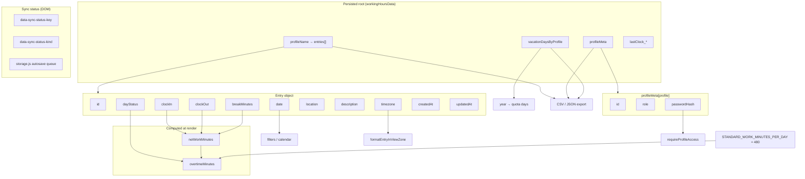

# Variables Documentation

**Product:** Working Hours Tracker  
**Last updated:** 2026-07-07  
**Purpose:** Authoritative dictionary of persisted fields, configuration constants, computed values, and client storage keys.

---

## 1. How to Read This Document

Each variable includes:

| Column | Meaning |
|--------|---------|
| **Variable name** | Key as stored in code or JSON |
| **Friendly name** | Human-readable label |
| **Definition** | Business meaning |
| **Formula / rule** | Derivation, validation, or default |
| **App location** | Source files and UI surfaces |
| **Example** | Representative value |

---

## 2. Root Payload Wrapper (export / API)

| Variable name | Friendly name | Definition | Formula / rule | App location | Example |
|---------------|---------------|------------|----------------|--------------|---------|
| `exportedAt` | Export timestamp | When snapshot was generated | ISO-8601 UTC at save/export | `data-sync.js`, `export.js` | `2026-07-06T14:30:00.000Z` |
| `data` | Data root | Container for all profiles and meta | Object; required in API body | `data-sync.js`, `api/working-hours-data.js` | `{ "Default": [...], "profileMeta": {} }` |

---

## 3. Profile Entry Array (`data[<profileName>]`)

Each profile name maps to an **array of entry objects**.

| Variable name | Friendly name | Definition | Formula / rule | App location | Example |
|---------------|---------------|------------|----------------|--------------|---------|
| `id` | Entry ID | Stable identifier for merge | Auto `generateId()` if missing; immutable | `entries.js`, `form.js`, `modal.js` | `a1b2c3d4-e5f6-...` |
| `date` | Entry date | Calendar day of record | Canonical `YYYY-MM-DD`; merge collapses one per date | `form.js`, `lib/merge-working-hours.js` | `2026-07-06` |
| `clockIn` | Clock in | Work period start | Normalized `HH:mm` or `null` | `time.js`, `form.js` | `09:00` |
| `clockOut` | Clock out | Work period end | Normalized `HH:mm` or `null` | `time.js`, `form.js` | `18:30` |
| `breakMinutes` | Break duration | Unpaid break in minutes | Integer ≥ 0; from value+unit fields | `form.js`, `modal.js` | `60` |
| `dayStatus` | Day status | Classification of day | Enum: `work`, `sick`, `holiday`, `vacation` | `constants.js`, `form.js` | `work` |
| `location` | Work location | Where work occurred | Enum: `WFO`, `WFH`, `Anywhere`; legacy `AW` → `Anywhere` | `form.js`, `render.js` | `WFH` |
| `description` | Description | Free-text note | Optional string; may be translated in UI | `form.js`, `render.js`, `i18n.js` | `Sprint planning` |
| `timezone` | Entry timezone | IANA zone for entry times | Valid IANA string; default `Europe/Berlin` | `timezone-picker.js`, `time.js` | `Asia/Jakarta` |
| `createdAt` | Created at | First creation time | ISO-8601; earliest on merge | `form.js`, merge lib | `2026-07-06T07:00:00.000Z` |
| `updatedAt` | Updated at | Last modification time | ISO-8601; **latest wins** on merge | `form.js`, merge lib | `2026-07-06T17:00:00.000Z` |

### Computed from entry fields (not stored)

| Variable name | Friendly name | Definition | Formula / rule | App location | Example |
|---------------|---------------|------------|----------------|--------------|---------|
| `netWorkMinutes` | Net work minutes | Paid work duration | `max(0, (clockOut−clockIn) − breakMinutes)`; null if invalid span | `time.js` (`workingMinutes`) | `480` |
| `overtimeMinutes` | Overtime minutes | Minutes above standard day | If `dayStatus==='work'`: `max(0, netWorkMinutes − 480)` else `0` | `render.js`, `stats-summary.js` | `30` |
| `grossMinutes` | Gross span minutes | Clock span before break | `clockOut − clockIn`; null if negative | `time.js` | `540` |

**Standard day constant:** `STANDARD_WORK_MINUTES_PER_DAY = 480` (8 hours) in `js/constants.js`.

---

## 4. Profile Metadata (`data.profileMeta`)

| Variable name | Friendly name | Definition | Formula / rule | App location | Example |
|---------------|---------------|------------|----------------|--------------|---------|
| `profileMeta` | Profile metadata root | Map of profile name → meta object | Reserved top-level key | `profile.js` | `{ "Default": { ... } }` |
| `profileMeta[].id` | Profile ID | Stable profile identifier | `profile-` + `generateId()` on ensure | `profile.js`, `export.js` | `profile-x7k2...` |
| `profileMeta[].role` | Profile role | Display role label | Trimmed string; UI read-only except modals | `profile.js`, `handlers.js` | `Senior Engineer` |
| `profileMeta[].passwordHash` | Password hash | Profile unlock secret | SHA-256 hex of password; never plaintext | `profile.js` | `9f86d081...` |
| `profileMeta[].passwordEncrypted` | Password hash alias | Legacy/normalized mirror | Sync normalizes to match `passwordHash` | `data-sync.js` | Same as hash |

---

## 5. Vacation Settings (`data.vacationDaysByProfile`)

| Variable name | Friendly name | Definition | Formula / rule | App location | Example |
|---------------|---------------|------------|----------------|--------------|---------|
| `vacationDaysByProfile` | Vacation root | Per-profile year allowances | Reserved top-level key | `vacation-days.js` | `{ "Default": { "2026": 24 } }` |
| `vacationDaysByProfile[profile][year]` | Annual vacation quota | Allowed vacation days | Integer 0–365 per year string key | `vacation-days.js`, `infographic.js` | `24` |

---

## 6. Clock Shortcut State (`data.lastClock_<profile>`)

| Variable name | Friendly name | Definition | Formula / rule | App location | Example |
|---------------|---------------|------------|----------------|--------------|---------|
| `lastClock_<profile>` | Last clock state | Quick clock in/out memory | Key pattern `lastClock_` + profile name | `clock.js` | — |
| `lastClock_*.action` | Last action | Whether clocked in | `'in'` when active | `clock.js` | `in` |
| `lastClock_*.time` | Last time | Time of last action | `HH:mm` | `clock.js` | `09:15` |
| `lastClock_*.date` | Last date | Date of last action | `YYYY-MM-DD` | `clock.js` | `2026-07-06` |

---

## 7. Application Constants (`WorkHours` namespace)

| Variable name | Friendly name | Definition | Formula / rule | App location | Example |
|---------------|---------------|------------|----------------|--------------|---------|
| `STORAGE_KEY` | Local storage key | Root localStorage key | Fixed: `workingHoursData` | `constants.js`, `storage.js` | `workingHoursData` |
| `DAY_NAMES` | Weekday names | Full English weekday labels | Array Sun–Sat | `constants.js` | `Monday` |
| `NON_WORK_DEFAULTS` | Non-work defaults | Default times/location for sick/holiday/vacation | `{ breakMinutes:60, location:'Anywhere', clockIn:'09:00', clockOut:'18:00' }` | `constants.js`, `form.js` | — |
| `STANDARD_WORK_MINUTES_PER_DAY` | Standard work day | Baseline for overtime | `8 * 60` = `480` | `constants.js` | `480` |
| `SUPPORTED_YEAR_MIN` | Min filter year | Calendar/filter lower bound | `1970` | `constants.js`, `vacation-days.js` | `1970` |
| `SUPPORTED_YEAR_MAX` | Max filter year | Calendar/filter upper bound | `2070` | `constants.js` | `2070` |
| `DEFAULT_TIMEZONE` | Default timezone | Fallback IANA zone | `Europe/Berlin` | `constants.js`, `time.js` | `Europe/Berlin` |
| `LEGACY_DEFAULT_TIMEZONE` | Legacy timezone marker | Old static fallback in stored entries | Same value as default; used in edit migration | `constants.js`, `modal.js` | `Europe/Berlin` |
| `TIMEZONE_LABELS` | Timezone labels | Human labels for select zones | Map IANA → display string | `constants.js`, `time.js` | `Germany, Berlin` |

---

## 8. Browser `localStorage` Keys

| Variable name | Friendly name | Definition | Formula / rule | App location | Example |
|---------------|---------------|------------|----------------|--------------|---------|
| `workingHoursData` | App dataset | Full JSON payload | Same as `STORAGE_KEY` | `storage.js` | `{...}` |
| `workingHoursTheme` | UI theme | Selected theme id | One of 36 theme keys | `init.js` | `indonesia` |
| `workingHoursLanguage` | UI language | Locale override | Removed when `auto`; else locale code | `i18n.js` | `de` |
| `workingHoursLastProfile` | Last profile | Last selected profile name | String profile key | `handlers.js`, `init.js` | `Default` |
| `workingHoursLanguageRolloutStage` | Lang rollout stage | Gates visible languages | `g3` \| `g5` \| `g10` \| `g20` \| `all` | `i18n.js` | `all` |
| `workingHoursUiPackTranslationCache::{locale}` | UI translation cache | Cached network UI translations | Per-locale JSON | `i18n.js` | — |
| `workingHoursUserTextTranslationCache` | User text cache | Description/role translations | JSON map | `i18n.js` | — |
| `workingHours.infographicTimeframe` | Infographic period | Selected aggregation | `annual` \| `quarterly` \| `monthly` \| `weekly` | `infographic.js` | `monthly` |
| `workingHoursInternetSpeedDaily` | Internet speed log | Daily min/max/avg Mbps | Resets each calendar day | `init.js` | `{ date, min, max, sum, count }` |

---

## 9. Environment Variables (server)

| Variable name | Friendly name | Definition | Formula / rule | App location | Example |
|---------------|---------------|------------|----------------|--------------|---------|
| `REDIS_URL` | Redis connection | Production DB connection | Required on Vercel | `api/working-hours-data.js` | `redis://...` |
| `WORKHOURS_API_KEY` | API key | Optional write auth | Non-empty enables `X-API-Key` check | `api/working-hours-data.js` | `(secret)` |
| `WORKHOURS_REDIS_KEY` | Redis key override | Blob key name | Default `workingHoursData:v1` | `api/working-hours-data.js` | `workingHoursData:v1` |
| `WORKHOURS_KV_KEY` | Legacy key alias | Same as redis key | Fallback alias | `api/working-hours-data.js` | — |
| `PORT` | Dev server port | Local API port | Default `3010` | `dev/server.js` | `3010` |

---

## 10. In-Memory Runtime State (not persisted)

| Variable name | Friendly name | Definition | App location |
|---------------|---------------|------------|--------------|
| `_calendarYear`, `_calendarMonth` | Calendar view | Visible month | `calendar.js` |
| `_calendarSelectedDates` | Selected dates | Multi-select filter dates | `calendar.js` |
| `_entriesSort` | Sort state | Column sort key/direction | `render.js` |
| `_profileAuthSession` | Unlock sessions | Per-profile unlock flags | `profile.js` |
| `currentLanguage` | Active locale | Resolved UI language | `i18n.js` |
| `_selectedEntryIds` | Table selection | Checked entry ids | `render.js` |
| `_bulkActiveIndex` | Bulk row index | Active bulk row | `form.js` |

---

## 11. Sync Status (UI runtime, `sync-status.js`)

The save/sync status badge (`#saveDataStatus`) stores its display state in DOM data attributes so language changes can re-apply translations without losing context.

| Variable name | Friendly name | Definition | Formula / rule | App location | Example |
|---------------|---------------|------------|----------------|--------------|---------|
| `data-sync-status-key` | Status message key | i18n key suffix under `sync.*` | One of: `saving`, `saved`, `autoSaveRetrying`, `saveFailedConnect`, `autoSaveQueued`, `autoSavePending` | `sync-status.js`, `#saveDataStatus` | `saving` |
| `data-sync-status-kind` | Status CSS kind | Visual state class suffix | `saving` \| `saved` \| `retry` \| `error` \| `queued` \| `pending` | `sync-status.js` | `saved` |
| `data-sync-status-subs` | Status substitutions | JSON for `{attempt}`, `{max}` etc. | Serialized object for `I18N.t` | `sync-status.js` | `{"attempt":1,"max":3}` |

### Autosave timing constants (`storage.js`)

| Variable name | Friendly name | Definition | Value | App location |
|---------------|---------------|------------|-------|--------------|
| `AUTO_SAVE_DELAY_MS` | Autosave debounce | Delay before POST after `setData` | `800` | `storage.js` |
| `AUTO_SAVE_RETRY_MS` | Retry interval | Wait between failed save retries | `4000` | `storage.js` |
| `AUTO_SAVE_MAX_RETRIES` | Max retries | Attempts before error state | `3` | `storage.js` |

### Sync i18n keys (`sync.*` in `i18n.js`)

| Key | Friendly label | When shown |
|-----|----------------|------------|
| `sync.saving` | Saving… | Autosave or manual save in flight |
| `sync.saved` | Saved | Successful persistence |
| `sync.autoSaveRetrying` | Retrying {attempt}/{max} | Transient failure, retrying |
| `sync.saveFailedConnect` | Save failed (connection) | Retries exhausted or unreachable backend |
| `sync.autoSaveQueued` | Queued | Save scheduled |
| `sync.autoSavePending` | Pending sync | Awaiting sync completion |

---

## 12. Infographic Derived Keys (computed, not stored)

| Variable name | Friendly name | Definition | Formula / rule | Example |
|---------------|---------------|------------|----------------|---------|
| `periodKeyAnnual` | Year key | Annual bucket | `YYYY` from entry date | `2026` |
| `periodKeyQuarterly` | Quarter key | Quarter bucket | `YYYY-Qn` | `2026-Q2` |
| `periodKeyMonthly` | Month key | Month bucket | `YYYY-MM` | `2026-07` |
| `periodKeyWeekly` | ISO week key | Week bucket | `YYYY-Wnn` via `getISOWeek` | `2026-W27` |

---

## 13. Variable Relationship Chart

---

## 14. Merge and Integrity Rules

1. **Primary merge key:** `id:<id>` if present; else `date:<YYYY-MM-DD>`; else raw date fallback.
2. **Winner:** Row with latest `updatedAt` (fallback `createdAt`).
3. **Collapse:** One entry per canonical date per profile (newest wins).
4. **Sort:** Entries ascending by `date`.
5. **Production POST:** Full snapshot replace after normalize—omitted data is deleted.

---

## 15. Enum Quick Reference

| Field | Allowed values |
|-------|----------------|
| `dayStatus` | `work`, `sick`, `holiday`, `vacation` |
| `location` | `WFO`, `WFH`, `Anywhere` (import normalizes `AW`) |
| `theme` | 36 ids — see `DESIGN_GUIDELINES.md` |
| `infographic timeframe` | `annual`, `quarterly`, `monthly`, `weekly` |

---

## 16. Related Documents

- `DATA_SCHEMA_EXAMPLES.md` — JSON samples
- `FEATURE_LOGIC_CATALOG.md` — behavioral rules
- `API_CONTRACTS.md` — transport format
